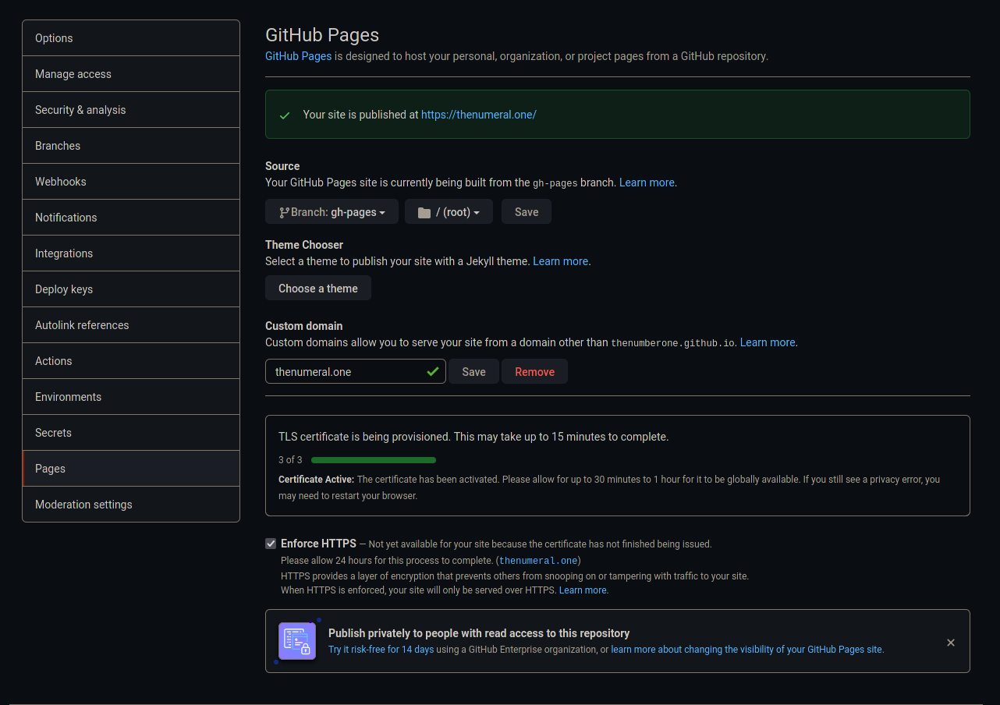

+++
title = "Setting Up This Website"
date = 2021-09-12
+++

## Inspiration

I have wanted to set up a personal website for ages.
But, I have repeatedly put it off for one reason or another.
Recently, I found [Xe's Blog](https://christine.website/), and it inspired me to try to create a website again.

## Process

In order to make this as easy as possible, I have decided to use a static site generator.
After some research, I decided to go with [Zola](https://www.getzola.org/documentation/getting-started/overview/) for the following reasons:
  * It is written in Rust.
  * It seems feature rich and easy to use.
  * It is the most starred static generator written in Rust.
    
To start, I cloned my super old git pages repository from 2017.

```sh
git clone https://github.com/TheNumberOne/TheNumberOne.github.io
git branch main
git checkout main
```

To install Zola, I wanted to use Nix. So, I first installed Nix:

```sh
paru -Syu nix

# TBH, I did this in vim. This is to fix an issue with nix on non-nixos systems.
# https://github.com/NixOS/nix/issues/2311
sudo sed -i 's/# sandbox = false/sandbox = false/' /etc/nix/nix.conf 

sudo systemctl enable --now nix-daemon.service
sudo gpasswd -a $USER nix-users

# logging out and back in is probably sufficient
reboot

nix-channel --add https://nixos.org/channels/nixpkgs-unstable
nix-channel --update
```

I can now temporarily install Zola using `nix-shell -p zola`. I initialized everything with `zola init`.
I then followed [Zola's guide](https://www.getzola.org/documentation/getting-started/overview/) to set up some basic pages.
After getting this page and a couple other pages working, it was time to deploy :smile:.

First, I created `.github/workflows/main.yml` as suggested by <https://www.getzola.org/documentation/deployment/github-pages/>.
I then created a github token to add to my repository's secrets, and not too long after I had this website working on github pages.

## Custom Domain

Next, I wanted to setup a custom domain.
First, I bought `thenumeral.one` from [NameCheap](https://www.namecheap.com>).
Then, I changed the github page settings to use my domain.



Finally, I added two cname records in NameCheap

| Host   | Value                     |
| ------ | ------------------------- |
| `@`    | `thenumberone.github.io.` |
| `www`  | `thenumberone.github.io.` |

After waiting around 20 minutes, this website was working!